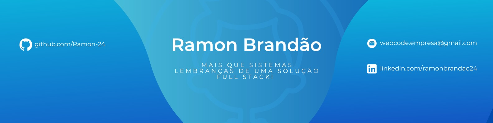

# Portfólio Ramon Brandão 

  
  
  
  

## 👋 Sobre Mim

Olá! Sou **Ramon Brandão**, Desenvolvedor Full Stack de 17 anos, apaixonado por criar soluções digitais completas. Fundador da WebCode Tech, especializado em:

- 🖥️ Desenvolvimento Web
- 📱 Aplicativos Mobile
- 🤖 Automações Inteligentes
- 🎨 UI/UX Design

## 🛠 Tecnologias

### Front-end

### Back-end

### Mobile

## 📂 Projetos

| Projeto | Descrição | Tecnologias | Link |
|---------|-----------|------------|------|
| WebCode Platform | Plataforma de soluções digitais | Next.js, Node | [Ver](https://...) |
| AutoBot | Automação de tarefas | Python, Flutter | [GitHub](https://...) |

## 📊 GitHub Stats

  
  
  
  

## 📩 Contato

---

  Feito com ❤️ por Ramon Brandão

